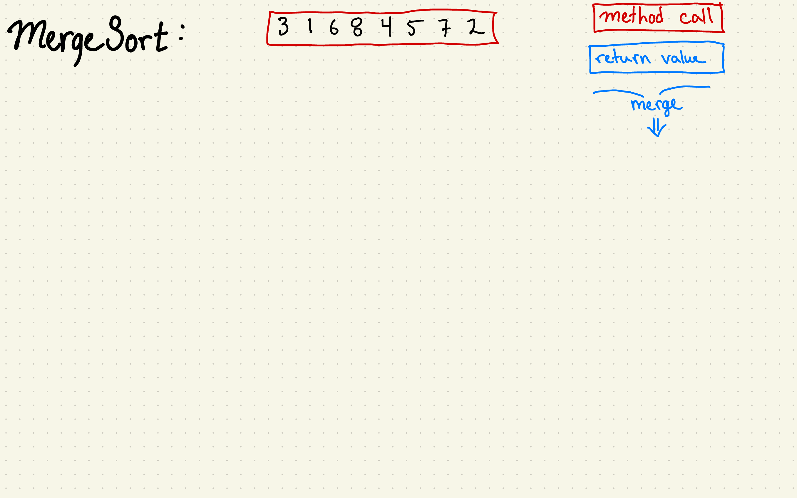

## **Merge Sort**
### Descrizione:
**Merge Sort** è un algoritmo di ordinamento **divide et impera**, che funziona suddividendo ricorsivamente l'array in due metà, ordinando ciascuna metà e quindi **unendo (merging)** le due metà ordinate. Questo algoritmo è molto efficiente e ha una complessità temporale di \(O(n \log n)\) nel caso migliore, peggiore e medio. La sua stabilità lo rende utile per ordinare strutture dati che mantengano l'ordine relativo degli elementi con lo stesso valore.

---



### **Invariante di ciclo**:
> Durante ogni fase di unione (merge), gli array parzialmente ordinati vengono combinati per produrre un array ordinato. L'invariante è che gli array temporanei contengono sempre sotto-array ordinati.

---

### **Passi Fondamentali**:
1. **Inizializzazione**:
   - Dividi l'array in due metà.
   - Le due metà vengono trattate come array separati e ordinati ricorsivamente.

2. **Conservazione**:
   - Durante il processo di unione, gli elementi vengono combinati da due array ordinati, creando un array ordinato.
   - L'invariante è preservato perché ogni combinazione di sotto-array risulta in un array ordinato.

3. **Conclusione**:
   - Alla fine, l'array originale viene ordinato tramite il processo di unione ricorsiva.

---

### **Pseudocodice (Stile Cormen)**:
*Nota: Lo stile Cormen (CLRS) utilizza valori "sentinella" (∞) per semplificare il codice, evitando controlli sui limiti degli array temporanei.*

```cpp
// Unisce due sotto-array A[p..q] e A[q+1..r]
MERGE(A, p, q, r)
    n1 <- q - p + 1
    n2 <- r - q

        L[i] <- A[p + i - 1]
    for j <- 1 to n2
        R[j] <- A[q + j]

    L[n1 + 1] <- R[n2 + 1] <- ∞  // Valore sentinella

    i <- j <- 1

    for k <- p to r
        if L[i] <= R[j]
            A[k] <- L[i]
            i <- i + 1
        else
            A[k] <- R[j]
            j <- j + 1

// Funzione principale ricorsiva
MERGE-SORT(A, p, q)
    if p < q
        r <- [(p + q) / 2] // Trova il punto medio
        MERGE-SORT(A, p, r)
        MERGE-SORT(A, r + 1, q)
        MERGE(A, p, q, r)
```

---

### **Esempio di Esecuzione**:
Supponiamo di ordinare `{12, 11, 13, 5, 6, 7}` con Merge Sort:
1. **Primo passaggio**:
   - L'array viene diviso in due metà: `{12, 11, 13}` e `{5, 6, 7}`.
2. **Secondo passaggio (sotto-array sinistro)**:
   - `{12, 11, 13}` viene diviso in `{12}` e `{11, 13}`.
   - `{11, 13}` viene ordinato e combinato in `{11, 13}`.
   - Combina `{12}` e `{11, 13}` in `{11, 12, 13}`.
3. **Terzo passaggio (sotto-array destro)**:
   - `{5, 6, 7}` è già ordinato, quindi viene combinato in `{5, 6, 7}`.
4. **Unione finale**:
   - Le due metà ordinate `{11, 12, 13}` e `{5, 6, 7}` vengono unite in un array ordinato finale: `{5, 6, 7, 11, 12, 13}`.

---

### **Analisi dell'algoritmo**:
1. **Complessità temporale**:
   - **Caso migliore**: \(O(n log n)\), quando l'array è già diviso in due metà equilibrate.
   - **Caso peggiore**: \(O(n log n)\), anche quando l'array è invertito, perché ogni divisione è sempre bilanciata.
   - **Caso medio**: \(O(n log n)\), che si verifica in generale.

2. **Complessità spaziale**:
   - \(O(n)\), a causa degli array ausiliari utilizzati durante la fase di unione.

---

### **Punti chiave sull'invariante**:
1. Ogni passaggio di unione produce un array ordinato.
2. Durante il processo di divisione e unione, gli array temporanei contengono sempre sotto-array ordinati.

---

### **Confronto con altri algoritmi**:
| **Caratteristica**      | **Merge Sort**            | **Quick Sort**           | **Insertion Sort**    |
|--------------------------|---------------------------|--------------------------|-----------------------|
| **Caso Migliore**         | \(O(n log n)\)           | \(O(n log n)\)          | \(O(n)\)              |
| **Caso Peggiore**         | \(O(n log n)\)           | \(O(n^2)\)               | \(O(n^2)\)            |
| **Spazio Aggiuntivo**     | \(O(n)\)                  | \(O(log n)\)            | \(O(1)\)              |
| **Stabilità**             | Sì                        | No                       | Sì                    |
