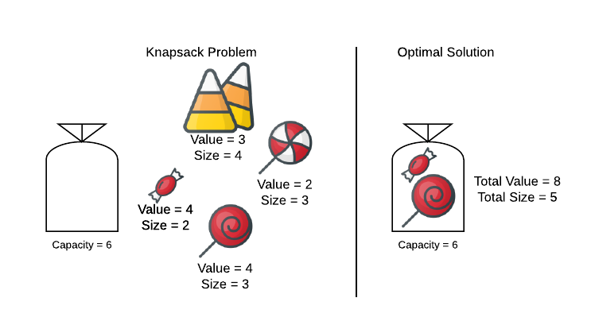
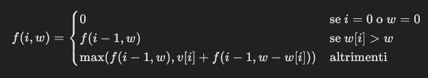

# Problema dello Zaino (Knapsack Problem)

Il problema dello **zaino** è uno dei problemi classici di ottimizzazione combinatoria. Si tratta di determinare il sottoinsieme ottimale di oggetti da inserire in uno zaino con una capacità limitata, massimizzando il valore totale. Esistono due varianti principali: lo **zaino 0/1** e lo **zaino frazionario**.

---

## 1. Problema dello Zaino 0/1

Nella variante 0/1, ogni oggetto può essere preso interamente oppure non preso (da cui il nome 0/1).

### Problema

- **Input**:  
  - \( n \): numero di oggetti.  
  - \( v[i] \): valore dell'oggetto \( i \).  
  - \( w[i] \): peso dell'oggetto \( i \).  
  - \( W \): capacità massima dello zaino.

- **Output**: Un sottoinsieme di oggetti tale che la somma dei loro pesi sia \( \leq W \), massimizzando la somma dei loro valori.



### Formula

La soluzione ottimale può essere descritta ricorsivamente:  


Dove:

- Caso base:
    - Se non ci sono oggetti `(i=0)` o lo zaino non ha capacità `(w=0)`, il valore totale è `00`.

- Oggetto troppo pesante:
    - Se il peso dell'oggetto corrente `w[i]` è maggiore della capacità residua dello zaino ww, l'oggetto non può essere incluso. Il valore ottimale rimane quello ottenuto considerando solo i primi `i−1` oggetti: `f(i−1,w)`.

- Oggetto includibile:
    - Se l'oggetto corrente può essere incluso, si calcola il valore massimo tra:
    - Non includere l'oggetto: `f(i−1,w)`,
    - Includere l'oggetto: `v[i]+f(i−1,w−w[i])`, dove `v[i]` è il valore dell'oggetto corrente e `f(i−1,w−w[i])` è il valore ottimale per il restante spazio disponibile.

### Algoritmo (Programmazione Dinamica)

Utilizza una matrice \( dp \) per memorizzare i risultati intermedi. La complessità è \( O(n * W) \), dove \( n \) è il numero di oggetti e \( W \) è la capacità dello zaino.

#### Esempio in C++:

```cpp
#include <iostream>
#include <vector>
#include <algorithm>
using namespace std;

int knapsack01(int W, const vector<int>& weights, const vector<int>& values) {
    int n = weights.size();
     vector<vector<int>> dp(n + 1, vector<int>(W + 1, 0));

    for (int i = 1; i <= n; ++i) {
        for (int w = 1; w <= W; ++w) {
            if (weights[i - 1] <= w) {
                dp[i][w] =  max(dp[i - 1][w], values[i - 1] + dp[i - 1][w - weights[i - 1]]);
            } else {
                dp[i][w] = dp[i - 1][w];
            }
        }
    }
    return dp[n][W];
}

int main() {
    int W = 50; // Capacità dello zaino
     vector<int> weights = {10, 20, 30};
     vector<int> values = {60, 100, 120};

     cout << "Valore massimo: " << knapsack01(W, weights, values) <<  endl;
    return 0;
}
```

### Complessità
- **Tempo**: \( O(n * W) \)
- **Spazio**: \( O(n * W) \) (riducibile a \( O(W) \) con ottimizzazione).

---

## 2. Problema dello Zaino Frazionario

Nella variante frazionaria, gli oggetti possono essere divisi, consentendo di prendere frazioni di essi.

### Problema

- **Input**:  
  - \( n \): numero di oggetti.  
  - \( v[i] \): valore dell'oggetto \( i \).  
  - \( w[i] \): peso dell'oggetto \( i \).  
  - \( W \): capacità massima dello zaino.

- **Output**: Il massimo valore totale ottenibile.

### Metodo Greedy

Ordina gli oggetti in base al rapporto valore/peso (\( v[i] / w[i] \)) in ordine decrescente. Aggiungi gli oggetti finché possibile, quindi prendi una frazione dell'oggetto successivo se la capacità dello zaino non è sufficiente.

### Algoritmo

L'algoritmo greedy ha complessità \( O(n log n) \), dove \( n \) è il numero di oggetti (a causa del costo dell'ordinamento).

#### Esempio in C++:

```cpp
#include <iostream>
#include <vector>
#include <algorithm>
using namespace std;

struct Item {
    int value, weight;
    double ratio;

    Item(int v, int w) : value(v), weight(w), ratio((double)v / w) {}
};

bool compare(const Item& a, const Item& b) {
    return a.ratio > b.ratio;
}

double fractionalKnapsack(int W, const  vector<int>& values, const  vector<int>& weights) {
    int n = values.size();
     vector<Item> items;

    for (int i = 0; i < n; ++i) {
        items.emplace_back(values[i], weights[i]);
    }

     sort(items.begin(), items.end(), compare);

    double totalValue = 0.0;

    for (const auto& item : items) {
        if (W >= item.weight) {
            totalValue += item.value;
            W -= item.weight;
        } else {
            totalValue += item.ratio * W;
            break;
        }
    }

    return totalValue;
}

int main() {
    int W = 50; // Capacità dello zaino
     vector<int> values = {60, 100, 120};
     vector<int> weights = {10, 20, 30};

     cout << "Valore massimo (frazionario): " << fractionalKnapsack(W, values, weights) <<  endl;
    return 0;
}
```

### Complessità
- **Tempo**: \( O(n log n) \) (per l'ordinamento).
- **Spazio**: \( O(n) \).

---

## Confronto tra Zaino 0/1 e Frazionario

| Variante            | Complessità Temporale         | Complessità Spaziale | Metodo Utilizzato   |
|---------------------|-------------------------------|-----------------------|---------------------|
| Zaino 0/1          | \( O(n * W) \)            | \( O(n * W) \)   | Programmazione Dinamica |
| Zaino Frazionario   | \( O(n * n) \)             | \( O(n) \)           | Metodo Greedy        |

---